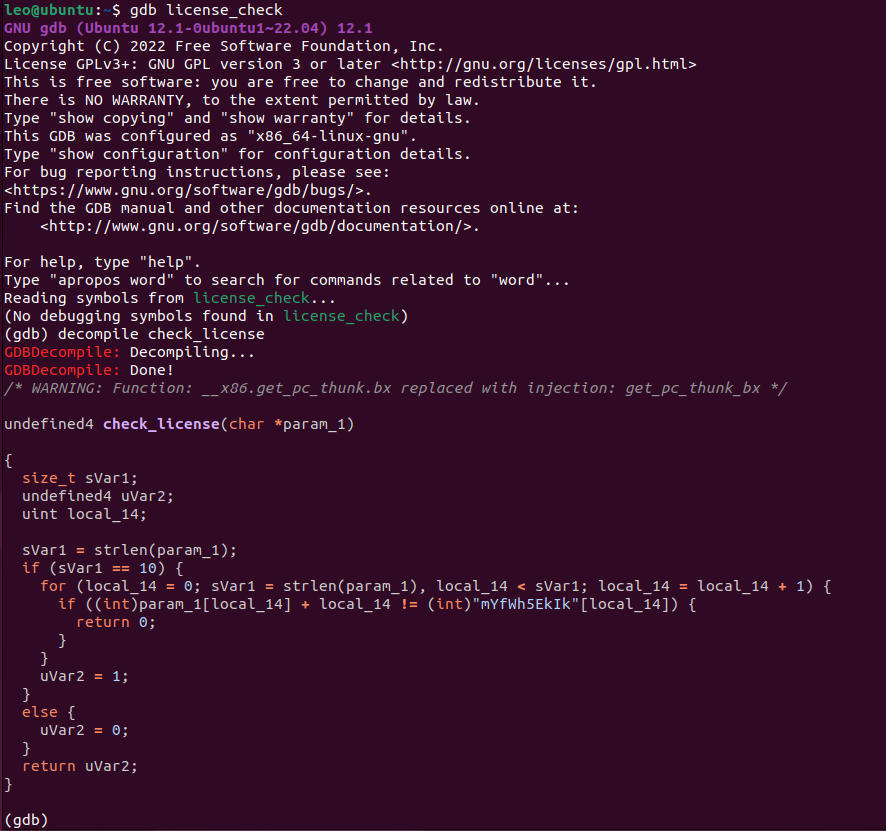

# GDBDecompile
This is a plugin that allows you to decompile functions with Ghidra's Decompiler from directly within GDB.



## Installation
1. Download and install [Ghidra](https://ghidra-sre.org/) and its dependencies.
2. Download DBGDecompile into your home directory and install it with the following commands:
```
$ git clone https://github.com/leowhitehead/GDBDecompile.git
$ cd GDBDecompile/
$ pip install -r requirements.txt
$ echo source $PWD/GDBDecompile.py >> ~/.gdbinit
```
3. Ensure that the value of `ghidra_path` in `~/GDBDecompile/config.toml` is set correctly

## Usage
Type `decompile <function name>` within GDB to decompile a function. If the name you provide is ambiguous, GDBDecompile will provide a list of potential functions and their full names as given by Ghidra.

## Development

This plugin is a work in progress and there are plans for a number of other features in upcoming version:
- [ ] Decompilation of memory ranges for analysing shellcode
- [ ] Support for multiple decompiler backends
- [ ] Interactivity with Ghidra for specifying data types and function signatures

Any contributions, suggestions or feedback are appreciated so feel free to submit any pull requests, raise issues or get in touch.